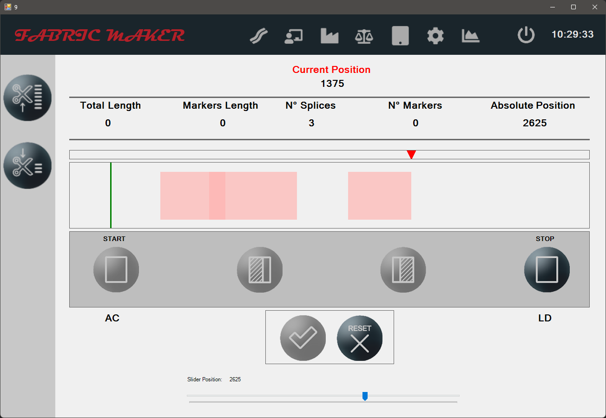

<!-- Improved compatibility of back to top link: See: https://github.com/othneildrew/Best-README-Template/pull/73 -->

<!--
*** Thanks for checking out the Best-README-Template. If you have a suggestion
*** that would make this better, please fork the repo and create a pull request
*** or simply open an issue with the tag "enhancement".
*** Don't forget to give the project a star!
*** Thanks again! Now go create something AMAZING! :D
-->

<!-- PROJECT SHIELDS -->
<!--
*** I'm using markdown "reference style" links for readability.
*** Reference links are enclosed in brackets [ ] instead of parentheses ( ).
*** See the bottom of this document for the declaration of the reference variables
*** for contributors-url, forks-url, etc. This is an optional, concise syntax you may use.
*** https://www.markdownguide.org/basic-syntax/#reference-style-links
-->

<!-- PROJECT LOGO -->
 

  

<!-- TABLE OF CONTENTS -->

  
Table of Contents

  <ol>
    <li>
      <a href="#about-the-project">About The Project</a>
    </li>
    <li>
      <a href="#getting-started">Getting Started</a>
    </li>
  </ol>

<!-- ABOUT THE PROJECT -->
## About The Project

This is a rpojprojectect written in C# and relying on WinForm. It is a UI to create a receipt for a fabric machinery that can be later exported to a json file.

(<a href="#readme-top">back to top</a>)

<!-- GETTING STARTED -->
## Getting Started

Just clone the repo, build the exe and run it.

<!-- LICENSE -->
## License

Distributed under the GNU licence.

(<a href="#readme-top">back to top</a>)

<!-- CONTACT -->
## Contact

Project Link: [https://github.com/NicolaComand/fabric-hmi](https://github.com/NicolaComand/fabric-hmi)

(<a href="#readme-top">back to top</a>)

